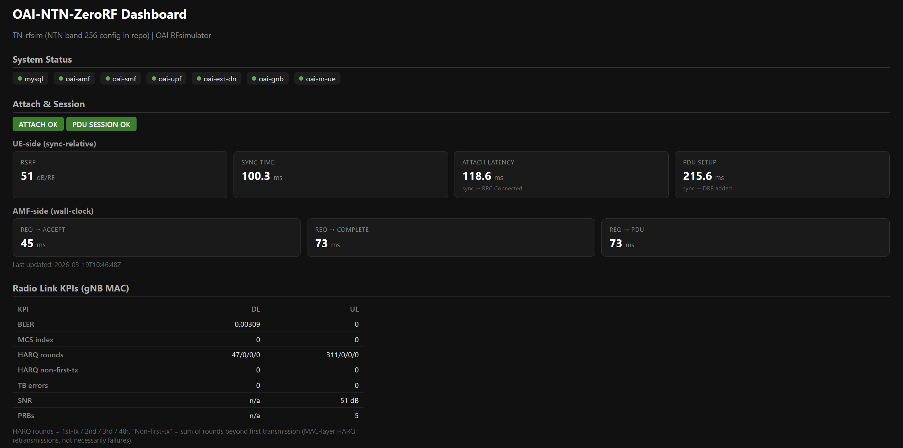
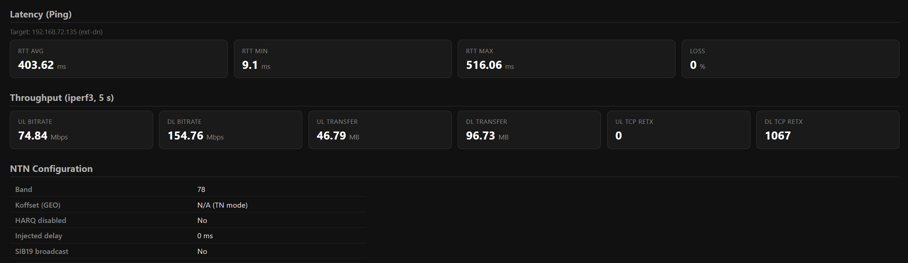
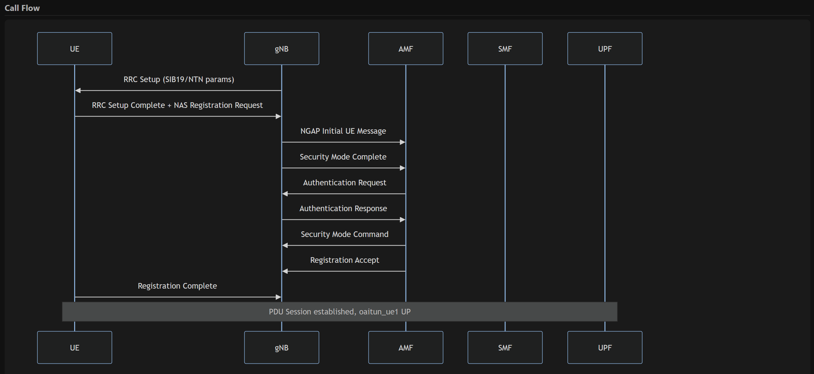

# OAI-NTN-ZeroRF

**Software-Only 5G NTN Validation Framework with Attach Trace and KPI Extraction**

Reproducible end-to-end 5G NTN (Non-Terrestrial Network) connection using OpenAirInterface with RFsimulator — no RF hardware, no USRP. Designed for control-plane validation and NTN configuration visibility.

## Architecture (High Level)

```
UE (OAI nrUE)  <--[RFsimulator TCP]-->  OAI gNB  <--[NGAP]-->  5G Core (AMF/SMF/UPF)
       |                                    |                          |
       +------------- optional tc netem delay (GEO ~135 ms) ----------+
```

- **NTN**: Band 256 config included (GEO Koffset 478, SIB19, extended timers, HARQ disabled). Currently runs on Band 78 due to an upstream OAI bug; see [docs/ntn_limitations.md](docs/ntn_limitations.md).
- **PHY boundary**: RF frontend replaced by RFsimulator; see [docs/phy_boundary.md](docs/phy_boundary.md).

---

## Step 0 — Install Prerequisites (from scratch)

If you already have Docker and Python3, skip to [Step 1](#step-1--clone-the-repo).

### Option A: Native Linux (Ubuntu 22.04 / 24.04) — Recommended

```bash
# Update system
sudo apt update && sudo apt upgrade -y

# Install Docker
sudo apt install -y ca-certificates curl gnupg
sudo install -m 0755 -d /etc/apt/keyrings
curl -fsSL https://download.docker.com/linux/ubuntu/gpg | sudo gpg --dearmor -o /etc/apt/keyrings/docker.gpg
echo "deb [arch=$(dpkg --print-architecture) signed-by=/etc/apt/keyrings/docker.gpg] \
  https://download.docker.com/linux/ubuntu $(lsb_release -cs) stable" | \
  sudo tee /etc/apt/sources.list.d/docker.list > /dev/null
sudo apt update
sudo apt install -y docker-ce docker-ce-cli containerd.io docker-compose-plugin

# Add your user to the docker group (log out and back in after this)
sudo usermod -aG docker $USER
newgrp docker   # or log out and back in

# Install Python3 and pip (for KPI scripts and GUI)
sudo apt install -y python3 python3-pip

# Install Flask (for the dashboard)
pip install --user flask
```

> **Note for native Linux:** The RT cgroup fix is handled automatically by `make run`.
> On native Linux with cgroup v2 (default on Ubuntu 24.04+), the fix is not needed at all — it only applies to cgroup v1 (common on WSL2 and older distros).

### Option B: Native Linux (Fedora / RHEL / Rocky)

```bash
# Install Docker
sudo dnf -y install dnf-plugins-core
sudo dnf config-manager --add-repo https://download.docker.com/linux/fedora/docker-ce.repo
sudo dnf install -y docker-ce docker-ce-cli containerd.io docker-compose-plugin
sudo systemctl start docker && sudo systemctl enable docker
sudo usermod -aG docker $USER
newgrp docker

# Install Python3 and Flask
sudo dnf install -y python3 python3-pip
pip install --user flask
```

### Option C: Windows with WSL2

1. Install [Docker Desktop for Windows](https://docs.docker.com/desktop/install/windows-install/) and enable **WSL2 backend** in settings
2. Install Ubuntu from the Microsoft Store, open it
3. Docker is automatically available inside WSL2 via Docker Desktop
4. Install Python3 and Flask inside WSL2:
   ```bash
   sudo apt update
   sudo apt install -y python3 python3-pip make
   pip install --user flask
   ```
5. Run everything from inside the WSL2 terminal

> **Note for WSL2:** Docker Desktop uses cgroup v1, so the RT cgroup fix is needed.
> `make run` applies it automatically — no manual steps required.

### Option D: macOS (Apple Silicon / Intel)

1. Install [Docker Desktop for Mac](https://docs.docker.com/desktop/install/mac-install/)
2. Install Python3: `brew install python3` (or use the system Python)
3. Install Flask: `pip3 install flask`
4. OAI images are built for `linux/amd64` — Docker Desktop will emulate them via Rosetta on Apple Silicon. Performance may be slow but functional.

### Verify installation (all platforms)

```bash
docker --version          # Need >= 22.0
docker compose version    # Need >= 2.36.0
python3 --version         # Need >= 3.8
```

---

## Step 1 — Clone the Repo

```bash
git clone <repo-url>
cd (folder name)
```

Or if you already have it, just `cd (foldername)`.

---

## Step 2 — Pull Docker Images (~10 GB download, first time only)

```bash
make pull
```

This pulls all 7 container images (MySQL, AMF, SMF, UPF, ext-dn, gNB, UE).

---

## Step 3 — Run the Demo

```bash
make run
```

This single command does everything:
1. Fixes the RT cgroup budget (needed on WSL2, done automatically)
2. Checks your environment (Docker, Compose, images, disk)
3. Starts the 5G Core (MySQL, AMF, SMF, UPF, ext-dn)
4. Starts the gNB (base station)
5. Injects NTN delay (optional)
6. Starts the UE (phone)
7. Validates the attach (checks tunnel + ping)
8. Exports KPIs and call flow diagram

Takes about 2-3 minutes. At the end you'll see `PASS: UE attach and data path validated`.

---

## Step 4 — View Results

### Option A: Web Dashboard
```bash
make gui
# Open http://localhost:5001 in your browser
# On Windows with WSL2, use http://localhost:5001 or http://<wsl-ip>:5001
```

### Option B: Reports on disk
| File | Description |
|------|-------------|
| `reports/summary.json` | Machine-readable KPIs (attach success, ping RTT, band, etc.) |
| `reports/kpis.md` | Human-readable KPI table |
| `reports/callflow.md` | Mermaid sequence diagram of the 5G attach flow |
| `logs/gnb.log` | gNB container log |
| `logs/amf.log` | AMF container log |
| `logs/nrue.log` | UE container log |

---

## Refernce that system works

The screenshots below show a successful run: all components up, UE attached, PDU session established, KPIs and call flow generated.

**1. Dashboard — status and attach**



*All components green; ATTACH OK and PDU SESSION OK; UE/AMF latency and radio KPIs.*

**2. Dashboard — latency, throughput, NTN config**



*Ping RTT to ext-dn, iperf3 UL/DL throughput, Band 78 / NTN config panel.*

**3. Call flow diagram**



*Mermaid sequence: RRC Setup, registration, security, PDU session established.*

---

## Step 5 — Stop Everything

```bash
make stop
```

To restart later: `make run` (handles everything again).

---

## All Makefile Targets

| Command | What it does |
|---------|-------------|
| `make check` | Environment and image check |
| `make run` | Full demo end-to-end (includes RT fix + check) |
| `make stop` | Tear down all containers |
| `make gui` | Start Flask dashboard on port 5001 |
| `make pull` | Pull all Docker images |
| `make clean` | Stop containers + remove logs and reports |
| `make logs` | Follow live container logs |

---

## Troubleshooting if required

### gNB or UE crashes with `pthread_create EAGAIN`
The RT cgroup fix wasn't applied. `make run` does it automatically, but if running manually:
```bash
docker run --rm --privileged --pid=host alpine \
  nsenter -t 1 -m -u -i -n sh -c \
  'echo 950000 > /sys/fs/cgroup/cpu/docker/cpu.rt_runtime_us'
```

### `make gui` says "Address already in use"
A previous GUI process is still running. `make gui` handles this automatically (kills the old one first). If it still fails: `fuser -k 5001/tcp` then retry.

### UE doesn't attach (no `oaitun_ue1`)
Check gNB is running: `docker compose ps`. If gNB exited, check `docker logs rfsim5g-oai-gnb` for the error. Most likely the RT cgroup fix above.

### Images not found
Run `make pull` to download all required images.

---

## Documentation

| Document | What it covers |
|----------|---------------|
| [README.md](README.md) | This file — setup and usage |
| [answers.md](answers.md) | Assignment answers (OAI vs srsRAN, why NTN, lessons learned) |
| [docs/architecture.md](docs/architecture.md) | Component diagram, data flow, network topology |
| [docs/phy_boundary.md](docs/phy_boundary.md) | What's real vs simulated at the PHY layer |
| [docs/ntn_limitations.md](docs/ntn_limitations.md) | RT cgroup root cause, NTN band 256 bug, gap table |
| [versions/component_versions.md](versions/component_versions.md) | Pinned image versions |

---
## Limitations

- Demo runs on **Band 78** (terrestrial) due to an upstream OAI CORESET#0 bug with Band 256; NTN configs are in the repo
- **No Doppler**, no beam tracking, no dynamic delay variation
- **Static delay** only (GEO approximation via tc netem)
- Not a throughput or PHY-accurate NTN emulator

See [docs/ntn_limitations.md](docs/ntn_limitations.md) for the full gap analysis.
