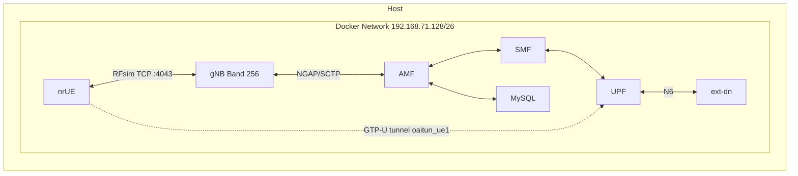

# OAI-NTN-ZeroRF Architecture

## Overview

This project implements a **software-only** 5G NTN (Non-Terrestrial Network) validation baseline using OpenAirInterface (OAI) with the RFsimulator. No RF hardware (USRP or other radios) is used.

## Component Diagram

## Data Flow

1. **Control plane**: UE (OAI nr-uesoftmodem) connects to gNB via **RFsimulator** (TCP port 4043). IQ samples are exchanged over the network instead of over-the-air. The gNB runs in server mode; the UE connects as client to the gNB's RFsimulator endpoint.
2. **NGAP**: gNB is connected to OAI 5G Core AMF over SCTP (NGAP). Registration, authentication, and PDU session establishment follow 3GPP SA procedures.
3. **User plane**: After PDU session is established, UE gets an IP on `oaitun_ue1`. Traffic is routed via UPF to the external data network container (`ext-dn` at 192.168.72.135).

## RFsimulator Role

- Replaces the RF frontend (antenna, PA, LNA, ADC/DAC).
- gNB and UE use a **channel model** (e.g. AWGN) and exchange time-domain samples over TCP.
- No real propagation delay, Doppler, or fading unless explicitly added (e.g. via `tc netem` on the container network).

## NTN Abstraction

- **Configured in gNB**: Band 256 (NTN S-band), `cellSpecificKoffset_r17 = 478` (GEO), satellite ephemeris, extended RRC timers, HARQ disabled.
- **SIB19** is broadcast when the gNB runs on an NTN band; it carries NTN-specific parameters.
- **Delay injection**: Optional `tc netem` delay (e.g. 135 ms one-way) on the gNB container simulates GEO propagation delay.

## Network Topology

| Component   | Network        | IP             |
|------------|----------------|----------------|
| MySQL      | public_net     | 192.168.71.131 |
| AMF        | public_net     | 192.168.71.132 |
| SMF        | public_net     | 192.168.71.133 |
| UPF        | public_net + traffic_net | 192.168.71.134, 192.168.72.134 |
| ext-dn     | traffic_net    | 192.168.72.135 |
| gNB        | public_net     | 192.168.71.140 |
| nr-UE      | public_net     | 192.168.71.150 |
